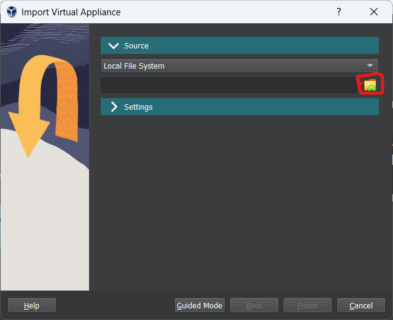
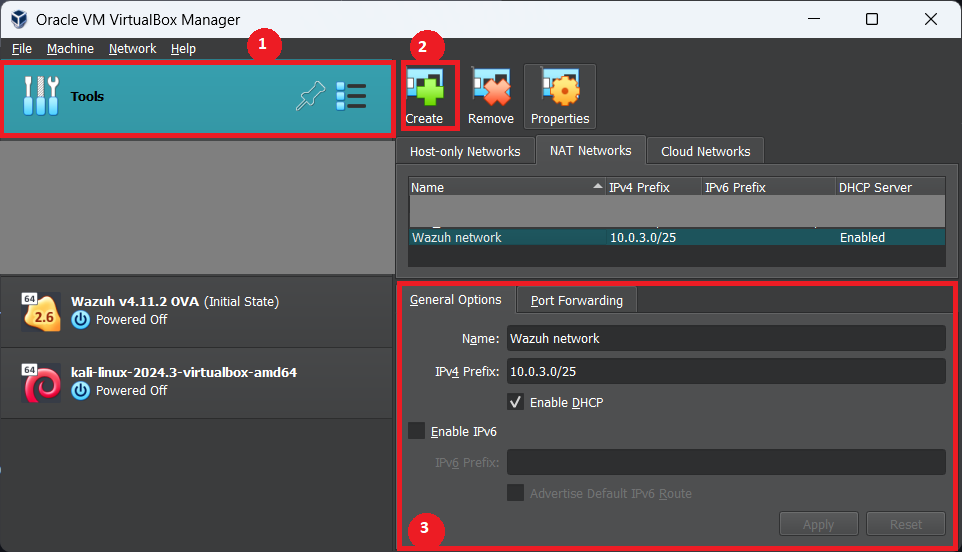
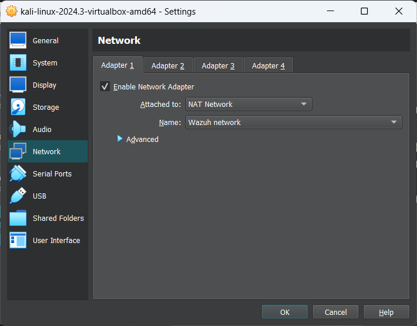
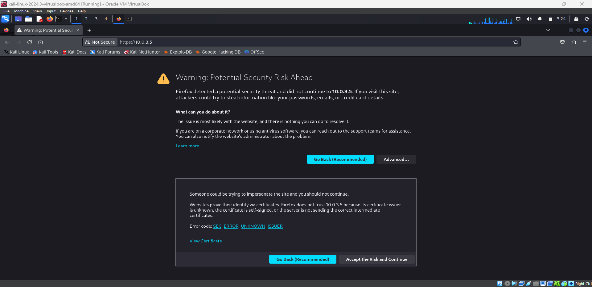
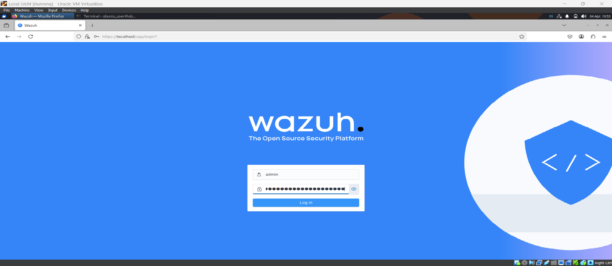

## Introduction

Hello everyone. Today we'll be demonstrating on setting up a home SIEM lab using Wazuh.

For those who don't know what a SIEM(Security Information and Event Management) is, it is like a software in a central system that monitors a group of connected systems. If you want to know more, GOOGLE it. That's how you learn.

Now let's dive into the demonstration.

## Pre-Requisites

- A laptop with atleast 8GB of RAM. (You would thank yourself if you had more)
- VMware Player or VirtualBox installed, along with a lightweight VM(virtual machine) installed in it.
- Stable internet connection.
- Basic knowledge of computer networks.

## Walkthrough

I have divided the setup into following modules for easier understanding:

1. Install any VM
2. Download and install the prebuilt VM for Wazuh
3. Network configurations in VirtualBox
4. Wazuh Setup

## Install Any VM

You can skip this step if you already have a VM installed in your virtualisation software.

- To quickly create a VM, go to this [Link](https://www.kali.org/get-kali/#kali-virtual-machines), and download a Kali pre-build VM.
- Extract the file contents to a location you would like to install the VM.
- Open VirtualBox > Add, and select the Virtual Machine Image file in the extracted folder.
- Your VM is ready to use. The credentials are `kali:kali`

## Download and install the prebuilt VM for Wazuh

- Download the pre-built VM from [Here](https://documentation.wazuh.com/current/deployment-options/virtual-machine/virtual-machine.html).
- Open VirtualBox > File > Import Appliance. Under Source, browse and select the downloaded OVA image, and click Finish. 
- Your Wazuh server is ready to use.

## Network Configurations in VirtualBox

Before setting up the Wazuh server and agent, we need to make changes such that both the VMs belong to the same LAN.

1. Create a new NAT network as described in the diagram
   - Select Tools > NAT Networks
   - Click _Create_
   - Edit the name and the subnet range. Click _Finish_

2. For each of the two VMs(Wazuh server and Kali VM), edit the network interface settings:
   - Select the VM > Settings > Network.
   - Change the adapter to `NAT Network` and name to the name of created NAT network.
     

We are done with the initial setup. Let's start with Wazuh.

## Wazuh Setup

1. Power on both the VMs.
2. In case of Wazuh server, login as the default user and type `ifconfig` in the terminal. Note down the IPv4 address of the machine.
3. Login to the Kali VM and browse to Wazuh server's IP in the web browser. - You'll get a warning due to self-signed certificate. Accept and proceed to the webpage
    - Login with default credentials `admin:admin`
   
4. Now that you're logged in, we'll have to deploy an agent to monitor it over the SIEM.
   - Go to Endpoint Security > Configuration Management > Deploy a new agent
   - Enter the IP address of the server
   - Copy and paste the generated link in the terminal, and run with root privileges. This will install the wazuh-agent in your VM.
   - Copy the next set of commands to start the wazuh-agent service.
5. Browse to the web UI and you'll notice that there is a new agent present. You are now ready to go. The VM is successfully deployed as an agent to the SIEM.
