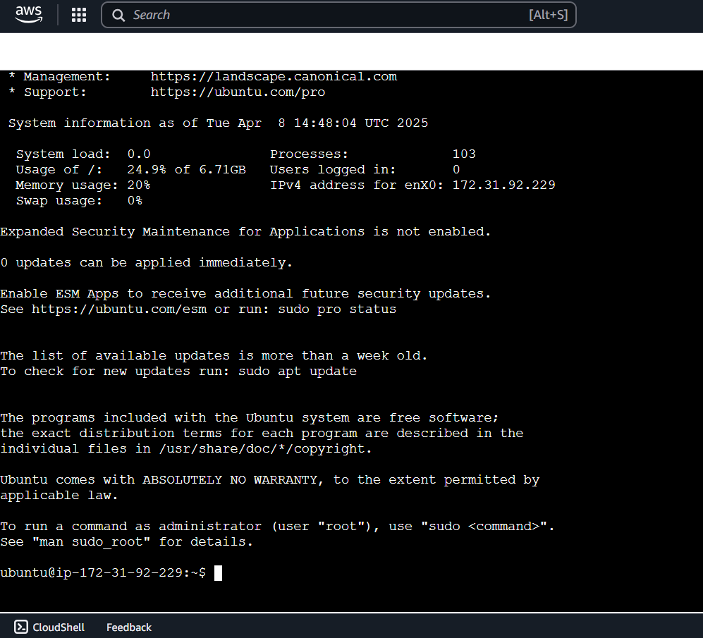
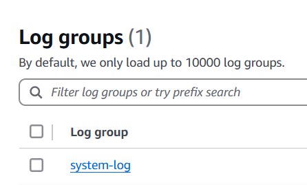
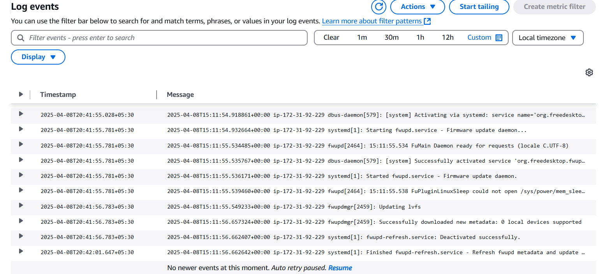

## Introduction

Hello everyone. Today we'll be demonstrating on monitoring EC2 logs on Amazon Cloudwatch

EC2 is a cloud based virtual machine in AWS. In this walkthrough, we'll be sending logs from our EC2 machine to Amazon Cloudwatch, which can later be analyzed.

Now let's dive into the demonstration.

## Pre-Requisites

- An AWS Free Tier Account
- AWS Services Used
  - EC2 (Elastic Compute Cloud)
  - Cloudwatch
  - IAM Role

## Walkthrough

I have divided the setup into following modules for easier understanding:

1. Create an EC2 instance
2. Create an IAM role and attach it to EC2
3. Setup EC2 as cloudwatch agent

## Create an EC2 instance

- This is a simple step. On the search bar above, search for EC2, and click on the option `Launch Instance`.
- In the redirected page, you will be presented with some configurations. Edit only the following:
  - Name: UbuntuAgent
  - AMI: Ubuntu
  - Instance type: t2.micro
  - Key Pair: Create new if you don't have one. Save the key pair in a secure location in your system.
- Leave the rest as default and click `Launch Instance`. You instance will be ready in a minute.

## Create an IAM role and attach it to EC2

- On the search bar, search for IAM, and navigate to IAM > Roles > Create Role
- Use the following configurations and click `Next`.  
   Trusted entity type: AWS Service
  Use case: EC2
- Add the following permission policies and click `Next`.
  - CloudWatchAgentServerPolicy
  - AmazonSSMManagedInstanceCore
- Add any name such as `RoleEC2` and click `Create Role`
- Navigate to the EC2 instance you created earlier and select **UbuntuAgent > Actions > Security > Modify IAM role**. Here, select the role `RoleEC2` that you created earlier and click `Update IAM Role`.

## Setup EC2 as cloudwatch agent

- Select the EC2 instance **UbuntuAgent > Connect** and connect using EC2 instance connect. You will be redirected to a screen like the one below:

- Run the following snippet of commands to install the amazon cloudwatch agent:

```
sudo apt update
wget https://s3.amazonaws.com/amazoncloudwatch-agent/ubuntu/amd64/latest/amazon-cloudwatch-agent.deb
sudo dpkg -i -E amazon-cloudwatch-agent.deb
```

- Edit the config.json file using the following command:

```
sudo nano /opt/aws/amazon-cloudwatch-agent/bin/config.json
```

This will open up a command line text editor. Here, paste the following snippet of configuration in json:

```
{
  "logs": {
    "logs_collected": {
      "files": {
        "collect_list": [
          {
            "file_path": "/var/log/syslog",
            "log_group_name": "system-log",
            "log_stream_name": "{instance_id}"
          }
        ]
      }
    }
  }
}
```

Look at the `file_path` and change the value to the path of log file you want to send to Cloudwatch. Change even the `log_group_name` since it will be displayed in Cloudwatch console.

To save it, press `Ctrl + O` and then `Enter`.  
To exit the editor, press `Ctrl + X`.

- Run the following command to start the cloudwatch agent on the instance:

```
sudo /opt/aws/amazon-cloudwatch-agent/bin/amazon-cloudwatch-agent-ctl \
    -a fetch-config \
    -m ec2 \
    -c file:/opt/aws/amazon-cloudwatch-agent/bin/config.json \
    -s
```

- Just for safety checks, run the following commands to start the agent, and check for status:

```
sudo systemctl enable amazon-cloudwatch-agent
sudo systemctl start amazon-cloudwatch-agent
sudo systemctl status amazon-cloudwatch-agent
```

In the output, ensure that the agent is `enabled` and `active (running)`.

- We are done with the setup. Now go to **Cloudwatch > Logs > Log groups**. You will find a log group named `system-log` or the name that you gave for the log group.

- Navigate **system-log > Log streams**. Click on the log stream that is present. You will be presented with an event list as follows:
  Here, you have the option to apply muliple filters related to date, time, timezone, events, etc.

**_Gentle reminder: Don't forget to delete the resources that you created as it may exhaust your free tier and charge you for the services used. Good luck._**

**_And we have accomplished our objective. Congrats._**
